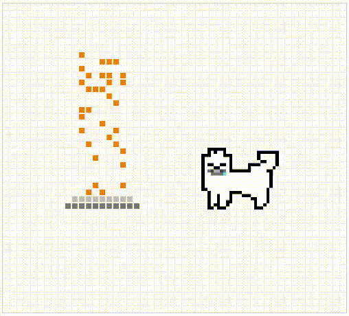

## 자바스크립트로 구현한 픽셀 아트 애니메이션

안녕하세요. 자바스크립트를 이용하여 귀여운 픽셀 강아지에게 무한히 사료를 제공하는 프로젝트에 오신걸 환영합니다. 무의미한 강아지 애니메이션을 보면서, 몇 분간 일상의 번뇌를 내려놓아 보세요. 

## 프로젝트 개요

이 프로젝트의 목표는 작은 강아지가 픽셀 캔버스 위에서 음식을 먹는 (아마도) 재미있고 동적인 픽셀 아트 애니메이션을 만드는 것입니다. 프로젝트는 순수 자바스크립트를 사용하며 DOM 조작, CSS 클래스 토글링, 타이밍 이벤트 등의 스킬들을 포함하고 있습니다.

## 주요 기능 소개

**픽셀 생성**  
`createEle` 함수로 특정 클래스를 가진 `div` 요소를 동적으로 생성하여 부모 요소에 추가했습니다.

**강아지 애니메이션**  
`dogMove` 함수로 `setInterval`을 사용하여 강아지 요소의 "move" 클래스를 토글링 하여 반복적인 애니메이션 효과를 만들었습니다. 강아지 스프라이트 이미지는 PiSKEL으로 제작하였습니다.

**픽셀 캔버스 크기 설정**  
`pixelCanvasWidthHeight` 함수와 변수 `num`을 기반으로 픽셀 캔버스의 너비와 높이를 설정했습니다. 더 큰 캔버스가 필요하면, 다른 동작 없이 `num` 값 만 조정하면 됩니다. 

**각 픽셀의 위치와 식별 값 지정**    
그리드를 형성하는 행과 열의 위치를 식별할 수 있도록 row와 column 클래스가 추가된 픽셀 요소를 생성했습니다. 체스판의 위치값에서 영감을 받아 개발했습니다. 

**사료 주기**  
`drawPlate` 함수로 캔버스에 접시를 그리고, `autoChangePixelBgColor` 함수로 무작위 위치에 음식을 표시했습니다. 강아지에게 본격적으로 사료를 주는 코드입니다.

**먹이 주기**  
`feed` 함수는 일정한 간격으로 `autoChangePixelBgColor` 함수를 호출하여 사료를 접시 위에 뿌립니다. 이후 `removeAllFood` 함수를 `setTimeout`으로 시간차를 두고 호출 하여 모든 음식을 제거했습니다. 강아지가 접시에 놓인 음식을 먹은 것 같은 효과를 줍니다. 

이로서 무한하게 사료를 먹는 행복한 강아지가 완성되었습니다. 

## 프로젝트 후기

유용함이라곤 전혀 없어 보이지만, 사실은 꽤나 쓸모있는 프로젝트 였습니다. 자바스크립트의 가능성을 발견하고 프론트엔드 기초를 닦을 수 있었습니다. 수많은 픽셀들을 만들기 위해 반복문을 사용하고, 애니메이션의 타이밍을 조절하기 위해 비동기 함수를 활용할 수 있었습니다. 변칙적인 패턴으로 애니메이션에 생동감을 주기 위해, 랜덤 함수를 실습할 기회도 얻었습니다. 틱톡 대신에 볼 수 있는 무의미하고 유해하지 않은 컨텐츠를 직접 만들게 되어 뿌듯했습니다.

## 결론

무언가 만들었다면, 그것만으로도 개발자에게는 유용한 경험일지도 모르겠습니다.
